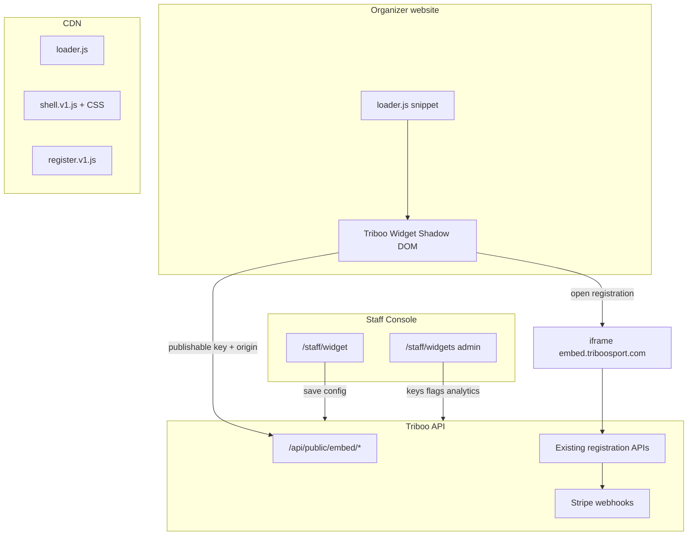

# Triboo Sports — Embeddable Widget Platform

## Product & Technical Specification (v0.1)

**Status:** Proposal — no implementation in this document  
**Audience:** Product, engineering, design, security, legal  
**Last updated:** 2026-06-13  
**Owner:** Triboo Sport platform team  

---

## Executive summary

Triboo Sport organizers need to **display events and complete athlete registrations on their own websites** without sending traffic away to a generic marketplace. Today, registration lives inside Triboo’s SPA (`/events/:slug` modal wizard). There is **no embed, widget, API key, or oEmbed layer**.

This specification defines a **world-class embeddable widget platform** comparable to Eventbrite embeds, Stripe Embedded Checkout, Calendly inline, and Shopify Buy Button — with:

- **One-snippet installation** for organizers
- **Premium mobile-first UX**
- **Full registration + Stripe checkout** synchronized with Triboo
- **Mandatory “Powered by Triboo Sport” branding** (non-removable)
- **Deep customization** without CSS knowledge
- **Shopify Theme Editor–style live preview** in the Organizer Portal
- **Enterprise-grade admin controls** in the Admin Portal

**Recommended architecture:** A **hybrid embed stack**:

1. **Lightweight JS loader** (`embed.triboosport.com/v1/loader.js`) — install snippet
2. **Web Component + Shadow DOM** for event browsing UI on the host page (CSS/JS isolation)
3. **First-party iframe overlay** on Triboo origin for auth, waivers, checkout, and 3DS (security + storage + PCI)
4. **Publishable widget keys + domain allowlist** for auth (never secret keys in the browser)
5. **Shared registration core** extracted from existing wizard steps (minimal duplication)

Phased delivery over **4 releases** (~6–9 months) de-risks payments, security, and organizer adoption.

**Rollout:** entire platform gated by env var `FEATURE_EMBED_WIDGET` (`off` | `internal` | `on`) — see [§5.5](#55-feature-flag-gating-env-var).

---

## Table of contents

1. [Goals & non-goals](#1-goals--non-goals)
2. [Current state audit](#2-current-state-audit)
3. [Risk register](#3-risk-register)
4. [Embedding technology comparison](#4-embedding-technology-comparison)
5. [Recommended architecture](#5-recommended-architecture)  
   - [5.5 Feature flag gating (env var)](#55-feature-flag-gating-env-var)
6. [Authentication & authorization](#6-authentication--authorization)
7. [Data model](#7-data-model)
8. [Public embed API](#8-public-embed-api)
9. [Widget runtime & installation](#9-widget-runtime--installation)
10. [Branding (mandatory)](#10-branding-mandatory)
11. [Customization system](#11-customization-system)
12. [Live preview (Organizer Portal)](#12-live-preview-organizer-portal)
13. [Organizer Portal — Website Widget section](#13-organizer-portal--website-widget-section)
14. [Admin Portal — Widget management](#14-admin-portal--widget-management)
15. [Widget availability gate](#15-widget-availability-gate)
16. [Registration flow reuse](#16-registration-flow-reuse)
17. [Performance & Core Web Vitals](#17-performance--core-web-vitals)
18. [Security audit & controls](#18-security-audit--controls)
19. [Accessibility (WCAG 2.2 AA)](#19-accessibility-wcag-22-aa)
20. [SEO & structured data](#20-seo--structured-data)
21. [Analytics & dashboards](#21-analytics--dashboards)
22. [Versioning strategy](#22-versioning-strategy)
23. [Error & empty states](#23-error--empty-states)
24. [Implementation phases](#24-implementation-phases)
25. [Future roadmap](#25-future-roadmap)
26. [Success metrics](#26-success-metrics)
27. [Open questions](#27-open-questions)
28. [Appendix A — Install snippet examples](#appendix-a--install-snippet-examples)
29. [Appendix B — File reuse map](#appendix-b--file-reuse-map)
30. [Appendix C — Environment variables](#appendix-c--environment-variables)

---

## 1. Goals & non-goals

### Goals

| Goal | Detail |
|------|--------|
| **Display events** | Organizer’s **published + public** events on any allowed domain |
| **Browse in-widget** | Grid, list, carousel, single-event layouts |
| **Register in-widget** | Complete flow without leaving organizer site perception |
| **Sync with Triboo** | Same registrations, payments, waivers, emails, check-in QR |
| **Premium UX** | Mobile-first, fast, accessible, on-brand for organizer |
| **Zero maintenance** | Copy-paste snippet; auto-updates via loader version pin |
| **Organizer self-serve** | Theme editor, embed code, domain management |
| **Admin oversight** | Kill switch, analytics, abuse detection, version control |
| **Mandatory Triboo branding** | Elegant, fixed, legally required |

### Non-goals (v1)

- White-label removal of Triboo branding (enterprise tier may add *additional* co-branding, never removal)
- Guest/anonymous checkout (today requires athlete account — see [§16](#16-registration-flow-reuse))
- File-upload registration fields in embed (currently unsupported in main app)
- Organizer custom CSS injection (theming via tokens only — prevents XSS)
- Self-hosted widget bundle (always CDN-delivered)
- WordPress/Shopify plugins (v2 — SDK first)

---

## 2. Current state audit

### 2.1 What exists today

| Area | Current implementation | Widget relevance |
|------|------------------------|------------------|
| **Public events** | `GET /api/events/:slug`, marketplace search | Reuse filters: `status=published`, `visibility=public` |
| **Registration** | Modal wizard on `EventDetail.tsx` | Core reuse target |
| **Redux** | `registrationCheckoutSlice`, `athleteAuthSlice`, `marketplaceSlice` | Extract to embed bundle |
| **Payments** | Stripe Connect, `register/checkout`, `register/confirm`, webhooks | Server-side ready; client needs first-party iframe |
| **Athlete auth** | Email/password + optional Clerk OAuth; JWT in `localStorage` | **Iframe / first-party required** for embed |
| **Organizer portal** | `/staff` unified console, role-based nav | Add `/staff/widget` section |
| **Admin portal** | `/staff` admin nav, `People`, `Site settings` | Add `/staff/widgets` admin section |
| **Per-org config** | `organizer_settings` JSON KV | Store widget config |
| **Platform config** | `platform_settings` JSON KV | Global widget defaults, feature flags |
| **Public IDs** | `organizers.public_uuid`, `events.public_uuid` | Prefer UUIDs in embed API (not internal IDs) |

### 2.2 What does not exist

- Embed script, iframe routes, or `postMessage` protocol
- Publishable widget keys or domain allowlists
- Widget analytics pipeline
- Organizer-facing embed UI or preview
- Admin widget management
- CSP headers for embed subdomain
- Separate embed frontend build target

### 2.3 Registration flow map (reuse audit)

**Components** (`client/components/events/registration/`):

| Component | Reuse in embed |
|-----------|----------------|
| `WizardAuthStep` | ✅ High — email/password path |
| `WizardWaiverStep` | ✅ High |
| `WizardCheckoutStep` | ✅ High — minus portal `Link`s |
| `WizardResultStep` | ⚠️ Adapt — replace portal navigation with `postMessage` |
| `StripePaymentForm` | ✅ High — inside first-party iframe only |
| `EventRegistrationWizard` | ⚠️ Replace Dialog shell with iframe host or inline panel |
| `RegistrationPaymentReturnHandler` | ⚠️ Adapt — slug/return URL from embed context |

**API endpoints** (already embed-agnostic):

```
GET  /api/events/:slug
POST /api/events/:slug/discount/validate
POST /api/events/:slug/register/checkout      (requireAthlete)
POST /api/events/:slug/register/confirm       (requireAthlete)
POST /api/events/:slug/register/resume        (requireAthlete)
POST /api/events/:slug/waitlist               (requireAthlete)
GET  /api/config/payments
POST /api/webhooks/stripe
```

**Blockers for cross-origin embed without iframe:**

1. **No guest checkout** — auth required before checkout
2. **Third-party cookie/storage restrictions** — JWT + sessionStorage in parent iframe breaks on Safari / Chrome
3. **Clerk OAuth** — unreliable in third-party iframe; disable or popup-only in embed
4. **Stripe 3DS `return_url`** — must land on first-party Triboo page
5. **Portal links** in checkout/result steps

---

## 3. Risk register

| ID | Risk | Severity | Mitigation |
|----|------|----------|------------|
| R1 | **Third-party cookie death** breaks auth in pure iframe on organizer domain | Critical | Registration iframe on `embed.triboosport.com`; listing via Shadow DOM + public API |
| R2 | **XSS via organizer custom CSS/HTML** | Critical | Token-only theming; sanitize all HTML; no `dangerouslySetInnerHTML` from organizer config |
| R3 | **Widget key scraping / abuse** | High | Domain allowlist; rate limits; short-lived session JWT; anomaly detection |
| R4 | **Clickjacking** overlay attacks | High | `X-Frame-Options` / CSP `frame-ancestors` on embed origin; optional organizer opt-in confirmation |
| R5 | **PCI scope expansion** | High | Stripe Elements only inside Triboo iframe; no card fields in host Shadow DOM |
| R6 | **Duplicate registrations / race** | Medium | Existing idempotency keys in `registrationCheckoutSlice` — preserve |
| R7 | **Organizer embeds unpublished events** | Medium | API enforces `published` + `public`; widget key scoped to organizer |
| R8 | **Stale widget versions** | Medium | Loader version pin + admin force-upgrade channel |
| R9 | **SEO duplicate content** | Low | Canonical URLs point to Triboo marketplace; JSON-LD optional per organizer tier |
| R10 | **Support burden** | Medium | Install validator, status page, integration health in portal |
| R11 | **Stripe Connect not ready** | Medium | Gate widget registration on organizer payout readiness (same as paid events today) |
| R12 | **Legal / facilitator copy** | Medium | Mandatory checkout consent + Triboo branding in iframe flow |

---

## 4. Embedding technology comparison

| Approach | Pros | Cons | Verdict |
|----------|------|------|---------|
| **Full iframe** | Max isolation; Stripe/3DS/auth trivial; CSP simple | Harder deep styling on host; double scroll; height resize complexity | **Use for registration/checkout layer** |
| **Web Components + Shadow DOM** | CSS isolation on host; native multi-instance; no framework lock-in | No auth storage on host; build pipeline needed | **Use for event listing UI** |
| **JS SDK (loader)** | One snippet; lazy load; version pin; multi-widget | Must maintain public API contract | **Primary distribution** ✅ |
| **React package** | DX for React sites | Fragmentation; still need core bundle | **Thin wrapper v2** |
| **Vue / Angular packages** | Same | Low ROI early | **Defer** |
| **oEmbed** | WordPress auto-discovery | Limited customization | **Optional discovery v2** |
| **Direct API + headless** | Max flexibility | Not zero-maintenance | **Enterprise tier later** |

### Recommendation

**Hybrid: SDK loader + Shadow DOM shell + Triboo iframe for transactional flow**

```
Organizer website
├── <script src="https://embed.triboosport.com/v1/loader.js" data-key="twk_live_...">
├── <div id="triboo-widget" data-layout="grid">
│   └── #shadow-root
│       ├── Event cards (public API)
│       ├── "Powered by Triboo Sport" footer (mandatory)
│       └── on Register → opens iframe modal → embed.triboosport.com/register?...
└── postMessage ↔ Triboo iframe (height, complete, analytics)
```

This matches industry leaders:

- **Eventbrite** — widget + checkout redirect/overlay
- **Stripe** — Embedded Checkout iframe
- **Calendly** — inline widget + popup iframe for booking

---

## 5. Recommended architecture

### 5.1 System diagram



### 5.2 Subdomains

| Host | Purpose |
|------|---------|
| `embed.triboosport.com` | Loader, shell bundle, registration iframe app |
| `www.triboosport.com` | Main app (unchanged) |
| `cdn.triboosport.com` | Static assets, fonts (optional) |

### 5.3 Build targets (new)

| Package | Description |
|---------|-------------|
| `@triboo/embed-loader` | < 5 KB gzipped loader; async loads shell |
| `@triboo/embed-shell` | Web Component + layouts + theming |
| `@triboo/embed-register` | Iframe app: wizard steps, shared with main app via `@triboo/registration-ui` |
| `@triboo/embed-preview` | Portal preview frame (same shell, mock data toggle) |

Extract shared registration UI into `packages/registration-ui` consumed by main SPA and embed iframe.

### 5.4 Communication protocol (`postMessage`)

Strict allowlist of origins. Message envelope:

```typescript
type TribooEmbedMessage =
  | { type: "triboo:ready"; version: string; height: number }
  | { type: "triboo:resize"; height: number }
  | { type: "triboo:registration:opened"; eventSlug: string }
  | { type: "triboo:registration:complete"; registrationUuid: string; eventSlug: string }
  | { type: "triboo:registration:closed" }
  | { type: "triboo:analytics"; event: string; payload: Record<string, unknown> }
  | { type: "triboo:error"; code: string; message: string };
```

Parent → iframe:

```typescript
| { type: "triboo:parent:close" }
| { type: "triboo:parent:theme"; tokens: ThemeTokens }  // preview only
```

**Never pass secrets via postMessage.**

### 5.5 Feature flag gating (env var)

The entire embed platform ships **behind a server-side feature flag** so it can be developed on `main`, deployed to production safely, and enabled gradually without a separate long-lived branch.

#### Environment variable (source of truth)

```bash
# off (default) | internal | on
FEATURE_EMBED_WIDGET=off
```

| Value | Public embed API + loader | Organizer `/staff/widget` | Admin `/staff/widgets` | Live preview |
|-------|---------------------------|---------------------------|------------------------|--------------|
| **`off`** (default) | ❌ 404 / no loader | Hidden nav | Hidden nav | — |
| **`internal`** | ❌ 503 `{ code: "embed_disabled" }` | ✅ Visible (beta copy) | ✅ Visible | ✅ Staff-only preview token |
| **`on`** | ✅ Full traffic | ✅ Visible | ✅ Visible | ✅ |

**Unset or empty** → treated as `off`.

Accept truthy aliases in implementation: `1`, `true`, `yes` map to `on`; `internal`, `beta`, `staff` map to `internal`.

#### Layered gates (all must pass for public traffic)

```text
FEATURE_EMBED_WIDGET=on          ← global env (this section)
        ↓
organizer_widgets.status=enabled ← per-organizer admin toggle
        ↓
≥1 published public event          ← organizer availability gate (§15)
        ↓
domain in allowlist              ← session exchange
```

Even when `FEATURE_EMBED_WIDGET=on`, a single organizer can remain disabled via admin suspend or missing published event.

#### Server implementation

Central helper (proposed): `server/embedWidgetFeature.ts`

```typescript
export type EmbedWidgetFeatureMode = "off" | "internal" | "on";

export function getEmbedWidgetFeatureMode(): EmbedWidgetFeatureMode;

export function isEmbedWidgetPublicEnabled(): boolean;   // mode === "on"
export function isEmbedWidgetStaffEnabled(): boolean;    // mode === "on" | "internal"
```

Apply at:

- **All** `/api/public/embed/*` routes → `isEmbedWidgetPublicEnabled()` or 503
- **Organizer** `/api/organizer/widget/*` → `isEmbedWidgetStaffEnabled()` or 404
- **Admin** `/api/admin/widgets/*` → `isEmbedWidgetStaffEnabled()` or 404
- **CDN loader** `loader.js` → optional inline check or API health preflight

#### Client / staff portal

**Do not** rely on a separate `VITE_FEATURE_EMBED_WIDGET` for authorization (would drift from server). Instead:

1. Extend existing config endpoint:

```http
GET /api/config/features
```

```json
{
  "embedWidget": "off"
}
```

2. Redux: `appConfigSlice` (or dedicated `featuresSlice`) fetches once on staff layout mount.
3. `staffNav.ts`: include Widget nav items only when `embedWidget !== "off"`.
4. Route guards on `/staff/widget` and `/staff/widgets`: redirect to `/staff` if `off`.
5. Show **“Coming soon” / “Beta — internal preview”** banner when `internal`.

Public main app (`App.tsx`) does not need embed routes in v1 — embed lives on `embed.triboosport.com`.

#### Rollout playbook

| Stage | Env | Who sees it |
|-------|-----|-------------|
| Local dev | `internal` or `on` | Engineers |
| Staging / sandbox | `internal` | QA + select organizers (admin beta flag) |
| Production soft launch | `on` + per-org beta | Pilot organizers only |
| Production GA | `on` | All eligible organizers |

#### Admin override (optional, post-v1)

`platform_settings.embed_feature_override` could allow forcing `on` for a percentage of organizers without redeploy — **env var remains the master kill switch** for emergencies.

#### `.env.example` entry

Document in repo root `.env.example` (see [Appendix C](#appendix-c--environment-variables)).

---

## 6. Authentication & authorization

### 6.1 Credential model

| Credential | Exposure | Purpose |
|------------|----------|---------|
| **Publishable Widget Key** `twk_live_*` / `twk_test_*` | Public in HTML snippet | Identifies organizer widget; domain-bound |
| **Widget Session JWT** | HttpOnly cookie on `embed.triboosport.com` + optional memory | Short-lived (15 min); issued after origin check |
| **Athlete JWT** | HttpOnly cookie on embed origin | Existing athlete auth; **not** parent domain |
| **Admin/Organizer JWT** | Staff console only | Manage widget settings |
| **Secret keys** | Server only | Never exist for widget |

**Do not use** raw API keys with write access in embed snippets.

### 6.2 Domain validation flow

1. Loader sends `Origin` / `Referer` + `twk_live_*` to `POST /api/public/embed/session`
2. Server checks key active, organizer widget enabled, domain in allowlist (exact + optional `*.raceclub.com`)
3. Returns `{ sessionToken, expiresAt, configVersion }` + sets HttpOnly cookie
4. All subsequent embed API calls require valid session

**Development:** `localhost` auto-allowed in test mode keys only.

### 6.3 Comparison of auth options

| Method | Security | UX | Recommendation |
|--------|----------|-----|----------------|
| API Key in snippet | Low (scrapable) | Simple | ❌ Reject |
| Public token + domain bind | Medium-High | Simple | ✅ Primary |
| Signed JWT in snippet | Medium (rotation pain) | Medium | ⚠️ Session exchange only |
| OAuth for organizers | N/A for athlete embed | — | — |
| mTLS | High | Hard | Enterprise optional |

### 6.4 Widget access flags (admin)

```typescript
organizer.widget_access: "disabled" | "pending" | "enabled" | "suspended"
organizer.widget_beta: boolean
```

---

## 7. Data model

New migration set (do not edit `schema.sql` directly — migrations only):

### 7.1 `organizer_widgets`

One row per organizer (1:1).

| Column | Type | Notes |
|--------|------|-------|
| `id` | int PK | |
| `organizer_id` | int FK UNIQUE | |
| `public_uuid` | char(36) UNIQUE | External reference |
| `publishable_key` | varchar(64) UNIQUE | `twk_live_...` |
| `secret_key_hash` | varchar(255) NULL | For server-side HMAC if needed later |
| `status` | enum | `disabled`, `enabled`, `suspended` |
| `access_tier` | enum | `standard`, `beta`, `enterprise` |
| `config_json` | json | Theme, layout, feature flags |
| `config_version` | int | Increment on save; cache bust |
| `pinned_loader_version` | varchar(16) | e.g. `1.4.2` or `latest` |
| `allowed_domains` | json | string[] |
| `first_enabled_at` | datetime NULL | |
| `last_seen_at` | datetime NULL | Heartbeat from loader |
| `created_at` / `updated_at` | datetime | |

### 7.2 `widget_key_rotations`

Audit log for key reset/regenerate events.

### 7.3 `widget_analytics_events`

Partition-friendly time-series table:

| Column | Notes |
|--------|-------|
| `organizer_id`, `widget_id` | |
| `event_name` | `widget_view`, `event_click`, `registration_start`, … |
| `event_slug` | nullable |
| `session_id` | anonymous widget session |
| `referrer`, `user_agent`, `device_class` | |
| `country` | GeoIP optional |
| `metadata_json` | |
| `created_at` | |

Retention: 90 days hot, 2 years aggregate.

### 7.4 `widget_api_usage_daily`

Rollup for admin dashboard: requests/day per organizer, per endpoint, error rate.

### 7.5 Config JSON schema (organizer `config_json`)

```typescript
interface WidgetConfig {
  version: 1;
  layout: "grid" | "list" | "compact" | "carousel" | "hero-cards" | "single" | "upcoming";
  singleEventSlug?: string;
  filters?: { sportSlugs?: string[]; featuredOnly?: boolean; limit?: number };
  theme: {
    colors: { primary; secondary; accent; background; card; button; link; success; error; warning; border };
    fonts: { heading: GoogleFontId; body: GoogleFontId; button: GoogleFontId };
    cards: { radius; shadow; spacing; imageRatio; showBadges; animation: "none" | "subtle" | "lift" };
    buttons: { variant: "filled" | "outlined"; shape: "rounded" | "square"; showIcon };
  };
  sizing: { mode: "responsive" | "full" | "fixed"; widthPx?: number; visibility: "all" | "mobile" | "desktop" };
  locale: "auto" | "es" | "en";
}
```

Stored defaults in `platform_settings.setting_key = 'embed_platform_defaults'`.

---

## 8. Public embed API

Base: `/api/public/embed` — rate limited, no staff JWT. **Requires `FEATURE_EMBED_WIDGET=on`** ([§5.5](#55-feature-flag-gating-env-var)).

| Method | Route | Auth | Description |
|--------|-------|------|-------------|
| POST | `/session` | `twk_*` + Origin | Issue widget session |
| GET | `/config` | Widget session | Theme + layout config |
| GET | `/events` | Widget session | Organizer’s public published events |
| GET | `/events/:slug` | Widget session | Single event for single-event layout |
| POST | `/analytics` | Widget session | Batch beacon events |
| GET | `/health` | Widget session | Integration status for portal |

**Existing routes reused inside iframe (first-party):** all `/api/events/:slug/register/*` athlete routes.

New organizer staff routes:

| Method | Route | Auth |
|--------|-------|------|
| GET/PATCH | `/api/organizer/widget` | requireOrganizer |
| POST | `/api/organizer/widget/regenerate-key` | requireOrganizer owner |
| GET | `/api/organizer/widget/analytics` | requireOrganizer |
| GET | `/api/organizer/widget/preview-token` | requireOrganizer (short-lived preview) |

Admin routes:

| Method | Route | Auth |
|--------|-------|------|
| GET | `/api/admin/widgets` | requireAdmin |
| GET/PATCH | `/api/admin/widgets/:organizerId` | requireAdmin |
| POST | `/api/admin/widgets/:organizerId/reset-key` | requireAdmin |
| POST | `/api/admin/widgets/:organizerId/suspend` | requireAdmin |
| GET | `/api/admin/widgets/analytics` | requireAdmin |
| GET | `/api/admin/widgets/usage` | requireAdmin |
| PATCH | `/api/admin/embed-platform` | requireAdmin (global defaults) |

Update `api/swagger.yaml` for all new routes.

---

## 9. Widget runtime & installation

### 9.1 Install snippet (production)

```html
<!-- Triboo Sport Events Widget -->
<script
  async
  src="https://embed.triboosport.com/v1/loader.js"
  data-triboo-key="twk_live_xxxxxxxxxxxxxxxx"
  data-triboo-locale="auto"
></script>
<div
  id="triboo-widget"
  data-triboo-layout="grid"
  data-triboo-event=""
></div>
```

### 9.2 Loader responsibilities

- Validate container `#triboo-widget` (or `[data-triboo-widget]`) — **support multiple per page**
- Lazy load shell bundle after `requestIdleCallback` or intersection observer
- Fetch session + config
- Inject Web Component with closed Shadow Root
- Observe container width → responsive layout
- Open iframe modal on registration CTA
- Forward analytics beacons (batch + `sendBeacon` on unload)
- **Never pollute global scope** except `window.TribooEmbed = { open, destroy, version }`

### 9.3 Conflict avoidance

| Concern | Strategy |
|---------|----------|
| CSS conflicts | Shadow DOM closed mode |
| JS conflicts | No jQuery dependency; IIFE + ES modules |
| z-index wars | iframe modal at `2147483646`; documented override hook |
| Font loading | Google Fonts loaded inside shadow + iframe |
| Multiple widgets | Unique instance IDs; shared session |

### 9.4 iframe registration URL

```
https://embed.triboosport.com/v1/register?event=slug&category=123&theme=v42&session=...
```

CSP on embed origin:

```
Content-Security-Policy:
  default-src 'self';
  frame-ancestors https://*;  /* validated server-side against allowlist */
  connect-src 'self' https://api.triboosport.com https://api.stripe.com;
  script-src 'self' https://js.stripe.com;
  style-src 'self' 'unsafe-inline' https://fonts.googleapis.com;
  font-src https://fonts.gstatic.com;
```

---

## 10. Branding (mandatory)

### Requirements (non-negotiable)

- Text: **“Powered by Triboo Sport”** (localized: *“Con tecnología de Triboo Sport”*)
- Triboo Sport logo (SVG from design system)
- Minimum height 24px; clear space per brand guidelines
- Placed in widget chrome: **footer of shell** + **footer of registration iframe**
- `pointer-events: auto` — links to `https://www.triboosport.com/?utm_source=widget&utm_medium=embed&utm_campaign=organizer_{slug}`
- **Cannot** be hidden via config, CSS override, or DOM manipulation (loader re-injects on mutation observer tamper detect → degrade to watermark overlay)

### Enterprise tier (future)

May add **co-branding** (“Presented by {Organizer} · Powered by Triboo Sport”) — never solo organizer-only footer.

---

## 11. Customization system

Organizers configure via portal — **no raw CSS**.

### 11.1 Colors (design tokens)

All colors validated as `#RRGGBB` or `#RRGGBBAA`; contrast checker runs server-side (WCAG AA against background).

| Token | Used for |
|-------|----------|
| primary | CTAs, links, focus |
| secondary | Secondary buttons |
| accent | Badges, highlights |
| background | Widget background |
| card | Card surfaces |
| button | Button fill default |
| link | Inline links |
| success / error / warning | States |
| border | Dividers, card borders |

### 11.2 Typography (curated Google Fonts)

Allowed families: **Inter, Roboto, Poppins, Lato, Nunito, Montserrat, Open Sans**

- `headingFont`, `bodyFont`, `buttonFont`
- Weights limited to 400, 500, 600, 700
- Fonts loaded via Triboo CDN proxy (privacy + performance)

### 11.3 Layouts

| Layout | Behavior |
|--------|----------|
| **grid** | Responsive 1–3 columns |
| **list** | Horizontal cards, stack on mobile |
| **compact** | Dense rows for sidebars |
| **carousel** | Swipe + arrows; reduced motion fallback |
| **hero-cards** | Featured event hero + grid |
| **single** | One event (`singleEventSlug` required) |
| **upcoming** | Chronological, max N |

### 11.4 Cards & buttons

- Radius: 0–24px slider
- Shadow: none / sm / md / lg
- Spacing: tight / normal / relaxed
- Image ratio: 16:9, 4:3, 1:1
- CTA: Register / View / custom label (i18n)
- Button: filled / outlined; rounded / square; optional arrow icon

### 11.5 Widget sizing

- **responsive** (default): 100% container width
- **full**: breakout to viewport width (optional)
- **fixed**: `widthPx` with max-width 100%
- **visibility**: all / mobile-only / desktop-only (`matchMedia`)

---

## 12. Live preview (Organizer Portal)

Shopify Theme Editor–style split view:

```
┌─────────────────────────────────────────────────────────────┐
│  Website Widget                              [Save] [Publish]│
├──────────────────┬──────────────────────────────────────────┤
│  SETTINGS        │  PREVIEW                                  │
│  ─────────────   │  [Desktop ▼] [Tablet] [Mobile]            │
│  > Layout        │  ┌─────────────────────────────────────┐  │
│  > Colors        │  │  iframe / inline preview            │  │
│  > Typography    │  │  (real embed shell + mock/register) │  │
│  > Cards         │  └─────────────────────────────────────┘  │
│  > Buttons       │  [Events ▼] [Registration] [Empty] [Error]│
│  > Domains       │                                           │
│  > Install code  │                                           │
└──────────────────┴──────────────────────────────────────────┘
```

### Preview modes

- Entire widget
- Device breakpoints (375 / 768 / 1280)
- State toggles: events loaded, empty, loading skeleton, registration flow, checkout, success, payment error
- Uses `GET /api/organizer/widget/preview-token` → omits analytics, watermark “Preview”

### Instant update

Debounced 150ms: settings → `postMessage` to preview iframe → shell applies CSS variables in Shadow DOM.

Implementation: reuse `@triboo/embed-preview` package mounted in `StaffWidgetSettings.tsx`.

---

## 13. Organizer Portal — Website Widget section

### Route & nav

- **Path:** `/staff/widget`
- **Nav:** `staffPortal.nav.widget` — icon `Code` or `Globe`
- **Feature flag:** Nav item hidden when `GET /api/config/features` → `embedWidget === "off"` ([§5.5](#55-feature-flag-gating-env-var))
- **Roles:** `owner`, `organizer`, `marketing` (edit); others read-only
- **Guard:** organizer role; widget section visible always, **functional only when gate passed** ([§15](#15-widget-availability-gate))

### Tabs / sections

1. **Overview** — status, last seen, integration health (green/yellow/red)
2. **Customize** — live preview editor ([§12](#12-live-preview-organizer-portal))
3. **Install** — copy snippet, WordPress instructions (text), domain verification
4. **Domains** — allowlist manager + DNS/HTML verification optional v2
5. **Analytics** — organizer-scoped dashboard ([§21](#21-analytics--dashboards))

### Redux

New slice: `organizerWidgetSlice.ts` — all fetches via `createAsyncThunk` (never axios in components).

### Install experience

- One-click copy snippet
- “Send to developer” email template
- Validation widget: ping organizer site for snippet presence (optional crawler v2)

---

## 14. Admin Portal — Widget management

### Route & nav

- **Path:** `/staff/widgets`
- **Nav:** Admin only — after Analytics
- **Feature flag:** Same gate as organizer section — staff-visible at `internal`, full ops at `on`
- **Page:** `StaffWidgetsAdmin.tsx`

### Capabilities

| Feature | Description |
|---------|-------------|
| **Global list** | All organizers with widget status, last seen, version |
| **Enable/disable access** | Platform-level kill switch per organizer |
| **Reset / regenerate keys** | Invalidate `twk_*`; audit log |
| **Embed code view** | Admin copy for support |
| **Usage analytics** | Requests/day, sessions, errors, p95 latency |
| **API usage** | Endpoint breakdown, 4xx/5xx rates |
| **Deployed version** | Loader + shell semver across fleet |
| **Force update** | Pin all orgs to version or push `latest` |
| **Beta features** | Feature flags per organizer (`widget_beta`) |
| **Suspend compromised** | Instant suspend + optional key rotation |
| **Integration status** | Last heartbeat, domain mismatches, CSP errors reported |

### Enterprise hooks (future)

- SLA dashboard
- Dedicated embed subdomain
- Custom allowlist size
- Priority support queue

---

## 15. Widget availability gate

Widget **customization + install** unlocks when:

```sql
EXISTS (
  SELECT 1 FROM events e
  WHERE e.organizer_id = :organizerId
    AND e.status = 'published'
    AND e.visibility = 'public'
    AND e.deleted_at IS NULL
)
```

**Before unlock — onboarding screen:**

> **Publish your first event to unlock website integration.**  
> Athletes can register on Triboo once your event is approved and published. Then embed it on your site with one snippet.

CTA: **Go to Events** → `/staff/events`

Preview editor may be **read-only demo** with sample data before gate (optional — increases motivation).

---

## 16. Registration flow reuse

### Strategy: extract, don’t duplicate

```
packages/
  registration-ui/          # Presentational steps (no Redux)
  registration-core/          # Thunks, validators, session storage adapters
client/                     # Existing app imports registration-ui
embed/register/             # Iframe app imports registration-ui + embed auth adapter
```

### Step mapping

| Main app | Embed iframe |
|----------|--------------|
| `WizardAuthStep` | Same — hide Clerk in embed v1 |
| `WizardWaiverStep` | Same |
| `WizardCheckoutStep` | Same — replace portal links |
| `WizardResultStep` | Adapt — `postMessage` complete + email receipt note |
| `EventRegistrationWizard` Dialog | Full-page iframe layout |

### Auth in embed

- Email/password only v1
- Athlete JWT in HttpOnly cookie on `embed.triboosport.com`
- “Already registered?” login inline
- Profile completion inline (reuse `AthleteProfileCompletionForm`)

### Payment

- Reuse `StripePaymentForm`, Connect routing, webhooks
- `return_url` = iframe URL with `?resume=payment`
- Parent notified via `postMessage` on success

### What not to duplicate

- Server checkout/confirm/resume logic
- Waiver validation
- Fee breakdown (`shared/checkoutBreakdown.ts`)
- Email confirmations

---

## 17. Performance & Core Web Vitals

### Targets

| Metric | Target |
|--------|--------|
| Loader parse + execute | < 50ms |
| Time to first event card | < 1.2s (p75) |
| Full widget interactive | < 2.0s (p75) |
| Registration iframe open | < 800ms |
| LCP (host page) | Widget lazy-loads; does not block host LCP |

### Techniques

- Loader < 5KB gzip; shell code-split by layout
- `IntersectionObserver` — load when widget enters viewport
- Prefetch registration iframe on first CTA hover (`rel=prefetch`)
- API responses: ETag + `Cache-Control: public, max-age=60` for event lists
- CDN (Cloudflare) for all embed assets
- Image srcset from existing event hero URLs
- `loading="lazy"` on card images
- Analytics via `sendBeacon` (non-blocking)

### SSR

- **Host page:** not required (client-rendered shell)
- **SEO mode (optional v2):** server-rendered event list at `/api/public/embed/o/:organizerSlug/events.html` for crawlers — see [§20](#20-seo--structured-data)

---

## 18. Security audit & controls

| Threat | Control |
|--------|---------|
| **XSS** | Shadow DOM; no organizer HTML; sanitize event descriptions; CSP strict on embed |
| **CSP** | Separate policy embed subdomain; document required host CSP `frame-src https://embed.triboosport.com` |
| **CSRF** | SameSite cookies; session tied to widget key + origin |
| **Clickjacking** | Registration iframe uses `X-Frame-Options: ALLOW-FROM` replaced by CSP `frame-ancestors` allowlist |
| **Rate limiting** | 60 req/min/session public embed; 10 registration starts/hour/IP |
| **Domain validation** | Allowlist + Origin header check on every session |
| **Token expiration** | Widget session 15 min; athlete JWT standard TTL; refresh flow |
| **API abuse** | WAF rules; anomaly detection on analytics; auto-suspend |
| **Replay attacks** | Nonce on session exchange; idempotency keys on checkout (existing) |
| **CORS** | Public embed API: credentialed only for `embed.triboosport.com`; no `*` with credentials |
| **postMessage** | Validate `event.origin`; ignore unknown messages |
| **Secrets** | `twk_*` is publishable; rate limits + domain bind; rotate on leak |
| **Supply chain** | SRI hash optional on loader; semver pinning |

### Pen test scope (pre-GA)

- Domain bypass attempts
- postMessage injection
- Checkout manipulation (price, category)
- Widget key enumeration
- Stripe redirect hijack

---

## 19. Accessibility (WCAG 2.2 AA)

- Keyboard: all cards, carousel controls, modal trap focus in iframe
- Focus return to trigger element on modal close
- Screen reader: layout landmarks, live regions for loading/errors
- Color contrast: enforced in theme validator (4.5:1 text, 3:1 UI)
- `prefers-reduced-motion`: disable card animations and carousel autoplay
- ARIA: `role="dialog"` on registration iframe host; `aria-label` on CTAs
- Form errors associated with fields (`aria-describedby`)
- Language: `lang` from widget locale config

Embed accessibility statement linked from widget footer.

---

## 20. SEO & structured data

### Default (v1)

- Widget content is client-rendered — **limited SEO on organizer site**
- Event cards link to Triboo canonical URLs (`/events/:slug`) as optional organizer toggle

### SEO mode (v2 optional)

For organizers who want indexable events on their domain:

- **SSR proxy endpoint** or **organizer WordPress plugin** rendering JSON-LD
- Schema.org `SportsEvent` + `Offer` per event
- Open Graph tags via organizer page meta plugin
- `sameAs` pointing to Triboo marketplace listing

```json
{
  "@context": "https://schema.org",
  "@type": "SportsEvent",
  "name": "Maratón CDMX 2026",
  "startDate": "2026-03-15T07:00:00-06:00",
  "location": { "@type": "Place", "name": "Ciudad de México" },
  "organizer": { "@type": "Organization", "name": "..." },
  "offers": { "@type": "Offer", "url": "https://embed.triboosport.com/..." }
}
```

**Recommendation:** v1 focus on conversion; v2 SEO add-on for premium tier.

---

## 21. Analytics & dashboards

### Event taxonomy

| Event | Funnel stage |
|-------|--------------|
| `widget_view` | Awareness |
| `event_impression` | Consideration |
| `event_click` | Intent |
| `registration_open` | Intent |
| `registration_auth_complete` | Step 1 |
| `waiver_accepted` | Step 2 |
| `checkout_started` | Step 3 |
| `payment_succeeded` | Conversion |
| `registration_complete` | Conversion |
| `checkout_abandoned` | Drop-off |
| `widget_error` | Health |

Dimensions: device, browser, referrer, layout, event slug, widget version.

### Organizer dashboard

- Funnel visualization
- Top events by conversion
- Abandonment by step
- Compare date ranges

### Admin dashboard

- Fleet-wide usage
- Error heatmap by organizer
- Version adoption
- Abuse alerts

Privacy: no PII in analytics payloads; GDPR/LFPDPPP compliant retention; opt-out flag for EU visitors (future).

---

## 22. Versioning strategy

### Semver components

| Component | Version | Pinning |
|-----------|---------|---------|
| **Loader** | `loader@1.x` | URL path `/v1/loader.js` |
| **Shell** | `shell@1.x` | Loaded by loader semver range |
| **Register iframe app** | `register@1.x` | Query param or path |
| **Config schema** | `config.version` | Server migrates old configs |

### Organizer pinning

- Default: `latest` in minor range (`1.x`)
- Pin option in admin for fragile integrations
- **Force upgrade:** admin broadcast → loader bumps pinned orgs

### Breaking changes

- Major version new path: `/v2/loader.js`
- v1 supported minimum 18 months after v2 GA
- Deprecation warnings in portal + response headers

---

## 23. Error & empty states

| State | UX |
|-------|-----|
| **No events** | Illustration + “No upcoming events” + link to Triboo profile |
| **Event expired / closed** | “Registration closed” + notify organizer CTA |
| **Network failure** | Retry button + offline message |
| **Invalid / revoked key** | Organizer-only message in preview; public: generic “Widget unavailable” |
| **Maintenance** | Triboo status banner via loader config flag |
| **Payment failure** | Inline Stripe error + support link |
| **Organizer disabled/suspended** | “Organizer account inactive” |
| **Domain not allowed** | Dev console warning; public: widget does not render |
| **Unsupported browser** | Upgrade browser message (IE not supported) |
| **Rate limited** | “Too many requests — try again shortly” |

All states preserve **Powered by Triboo Sport** footer.

---

## 24. Implementation phases

### Phase 0 — Foundation (4–6 weeks)

- [ ] `FEATURE_EMBED_WIDGET` env + `server/embedWidgetFeature.ts` helper
- [ ] `GET /api/config/features` (+ Redux wiring for staff nav guards)
- [ ] Migrations: `organizer_widgets`, analytics tables
- [ ] Publishable key generation service
- [ ] `GET /api/public/embed/events` + session exchange
- [ ] `@triboo/embed-loader` POC
- [ ] Admin list + suspend (minimal)

### Phase 1 — Event display MVP (6–8 weeks)

- [ ] Shell Web Component: grid + list layouts
- [ ] Theming tokens (colors + fonts)
- [ ] Organizer portal: Install + Domains + basic customize
- [ ] Availability gate
- [ ] Mandatory branding
- [ ] Analytics: views + clicks

### Phase 2 — Registration iframe (8–10 weeks)

- [ ] Extract `registration-ui` package
- [ ] iframe app on `embed.triboosport.com`
- [ ] Auth + waiver + checkout ported
- [ ] postMessage protocol
- [ ] Stripe 3DS return handling
- [ ] Analytics: full funnel

### Phase 3 — Premium editor (6–8 weeks)

- [ ] Live preview (Shopify-style)
- [ ] All layouts + carousel
- [ ] Card/button advanced options
- [ ] Organizer analytics dashboard
- [ ] Admin fleet management + force version

### Phase 4 — Polish & GA (4 weeks)

- [ ] WCAG audit remediation
- [ ] Pen test fixes
- [ ] Performance hardening
- [ ] Documentation + support runbooks
- [ ] Beta → GA rollout flag

**Total estimate:** 28–36 weeks with 2–3 dedicated engineers + design + QA.

---

## 25. Future roadmap

| Feature | Tier | Notes |
|---------|------|-------|
| Dark mode | Standard | Auto from `prefers-color-scheme` + override |
| Multi-language | Standard | es/en v1; pt later |
| White-label enterprise | Enterprise | Co-brand only |
| AI event recommendations | Premium | Based on visitor geo/history |
| Embedded calendar | Standard | iCal feed + month view |
| Map view | Standard | Reuse marketplace map components |
| Countdown timers | Standard | Event start countdown on cards |
| Team registrations | Standard | Reuse team checkout when ready |
| Membership widgets | Enterprise | Recurring products |
| Sponsor banners | Premium | Organizer sponsor slots above grid |
| Live results | Premium | Post-race embed |
| Leaderboards | Premium | Event or organizer scoped |
| Merchandise | Enterprise | Shopify-style product cards |
| Donations | Enterprise | Stripe donation flow |
| QR check-in embed | Ops | Staff scanner not embed — athlete QR display widget |
| Multi-event cart | v3 | Cross-event checkout |
| React `@triboo/react-embed` | Developer | Wrapper SDK |
| WordPress plugin | GTM | Snippet generator + shortcode |

---

## 26. Success metrics

| Metric | 6-month target |
|--------|----------------|
| Organizers with widget enabled | 30% of active organizers |
| Install completion rate | > 70% of those who open Install tab |
| Widget-driven registrations | 15% of total registrations |
| Embed checkout conversion | Within 5% of native Triboo checkout |
| p75 widget load time | < 2s |
| Widget-related support tickets | < 3% of organizer tickets |
| Security incidents | 0 critical |

---

## 27. Open questions

1. **Clerk in embed v2?** Popup OAuth vs email-only v1 — recommend email-only v1.
2. **Unlisted events in widget?** Default: public published only; optional include `unlisted` with direct slug.
3. **Fee presentation in embed** — reuse organizer `fee_presentation` from Connect setup.
4. **Widget on Triboo marketplace organizer page?** Dogfood first.
5. **Legal terms in iframe** — reuse `LegalConsentNotice`; organizer terms visibility?
6. **Max domains per organizer** — suggest 10 standard, unlimited enterprise.
7. **Feature flag default in production** — ship with `off`; enable `internal` on staging only until Phase 1 complete.

---

## Appendix C — Environment variables

| Variable | Required | Default | Description |
|----------|----------|---------|-------------|
| `FEATURE_EMBED_WIDGET` | No | `off` | Master embed platform gate: `off` \| `internal` \| `on` |

**Examples**

```bash
# Production — disabled until GA
FEATURE_EMBED_WIDGET=off

# Staging / local — staff can use portal preview; public embed API still blocked
FEATURE_EMBED_WIDGET=internal

# GA — public embed live (per-organizer gates still apply)
FEATURE_EMBED_WIDGET=on
```

**Related (future, optional)**

| Variable | Purpose |
|----------|---------|
| `EMBED_WIDGET_CDN_ORIGIN` | Override loader CDN base (default `https://embed.triboosport.com`) |
| `EMBED_WIDGET_SESSION_TTL_SEC` | Widget session JWT lifetime (default `900`) |

Do **not** expose `FEATURE_EMBED_WIDGET` to the client via `VITE_*` — use `/api/config/features` only.

---

## Appendix A — Install snippet examples

### Grid (all events)

```html
<script async src="https://embed.triboosport.com/v1/loader.js" data-triboo-key="twk_live_abc123"></script>
<div id="triboo-widget" data-triboo-layout="grid"></div>
```

### Single event

```html
<div
  id="triboo-widget"
  data-triboo-layout="single"
  data-triboo-event="maraton-cdmx-2026"
></div>
```

### Programmatic open (advanced)

```javascript
window.TribooEmbed.openRegistration("maraton-cdmx-2026", { categoryId: 42 });
```

---

## Appendix B — File reuse map

| Existing asset | Path | Embed usage |
|----------------|------|-------------|
| Wizard steps | `client/components/events/registration/*` | Extract to package |
| Checkout slice | `client/store/slices/registrationCheckoutSlice.ts` | Shared thunks |
| Athlete auth | `client/store/slices/athleteAuthSlice.ts` | iframe only |
| Event detail API | `api/index.ts` marketplace routes | Public embed filter |
| Checkout breakdown | `shared/checkoutBreakdown.ts` | Unchanged |
| Stripe Connect | `server/stripeConnect.ts` | Unchanged |
| Staff nav | `client/utils/staffNav.ts` | Add widget nav items |
| Organizer settings | `organizer_settings` table | Migrate to dedicated tables |
| Platform settings | `server/platformSettings.ts` | Global embed defaults |
| Design tokens | `client/global.css` | Reference for default theme |
| i18n | `client/i18n/locales/*.json` | New `widget.*` namespace |

---

## Document history

| Version | Date | Author | Changes |
|---------|------|--------|---------|
| 0.1 | 2026-06-13 | Triboo Platform | Initial proposal from codebase audit |

---

*This document is a product specification only. Implementation must follow `AGENTS.md`: migrations for schema changes, Redux for data fetching, i18n for all user strings, swagger updates for API changes, and no Triboo branding removal in any tier without legal approval.*
